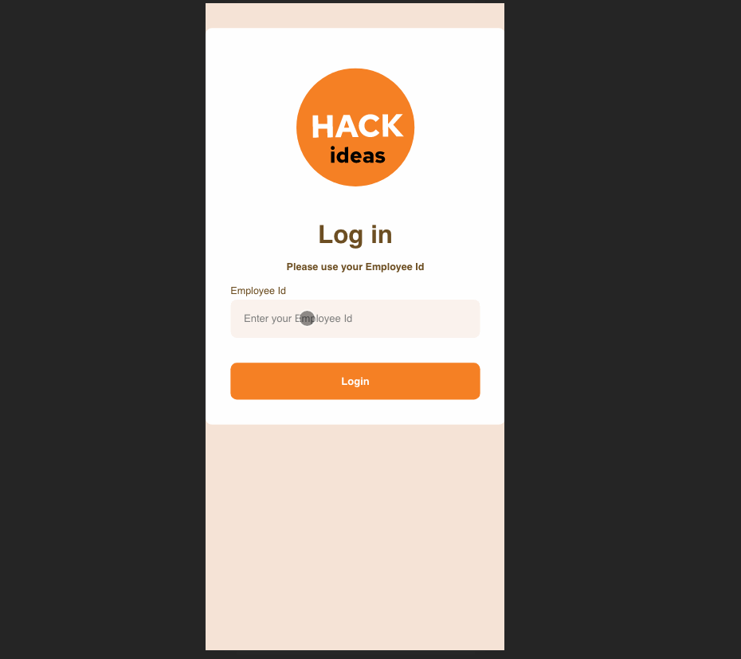
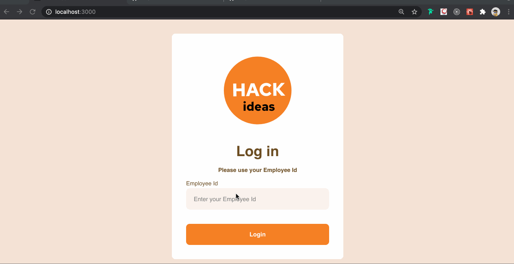

# Hack Ideas react application

## Design:
Design is done using Figma.
Link: https://www.figma.com/file/dYabTCqjE8AWo4g2xGHnCr/HackIdeas_Scripbox?node-id=0%3A1

## DEMO Mobile View .gif

## DEMO Desktop View .gif

## Features: 
1. Login: Login is tracked using localStorage. To logout, for now, we have to clear localStorage of browser
2. There is a json file to load some dummy data when the application starts
3. User can add an Hack Idea and add some tags with it.
4. User can upvote (also can cancel his vote)

## How to Install and Run:
1. Install: git clone or download this project and run: `npm install`
2. Run: `npm start`
